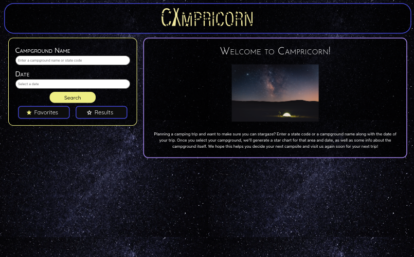

# Campricorn🐐🔥🏕️

## 📝 Description

Campricorn is a front-end application that utilizes two server-side APIs to help users find the best place to camp and stargaze. Users can input a state code or a campground name, and a date, see their list of favorite campsites, and choose a specific campground to view a star chart. Thanks in part to Bulma and a lot of custom CSS, Campricorn has a polished and responsive interface, thats easy to use. Deployed on GitHub Pages, Campricorn is the perfect app for anyone interested in astronomy and camping.


## Table of Contents

- [Description](#📝-description)
    - [User Story](#👤-user-story)
    - [Acceptance Criteria](#☑️-acceptance-criteria)
- [Technologies Used](#🛠️-technologies-used)
- [Resources](#📚-resources)
- [User Experience](#-🤳-user-experience)
    - [Screenshots](#📸-screenshots)
- [Links](#🔗-links)
- [Credits](#💻-credits)
- [License](#📃-license)


### 👤 User Story
```
AS someone interested in astronomy
I WANT to know what stars I might see above a national campground
SO THAT I can decide where to set up a campsite 
```


### ☑️ Acceptance Criteria
```
GIVEN a program that correlates star charts with campsite locations,
WHEN I open the page 
THEN I am met with a clean polished responsive interface.
WHEN I’m on the first page 
THEN I am shown an input form for either a state code or an campground name, and a date, as well as a list of my favorite campsites (if there are any)
WHEN I enter a state code
THEN I am given a random assortment of campgrounds to choose from in that state
WHEN I enter a campsite name
THEN I’m shown results of campgrounds that match the name
WHEN viewing search results,
THEN I am given the option to favorite specific campsites	
WHEN I select a campground
THEN I am given a star chart for that campground
```


## 🛠️ Technologies Used

<ul>
<li> HTML
<li> CSS
<li> JavaScript
<li> Bulma Framework
<li> jQuery
<li> DayJS
<li> Google Fonts
<li> Server Side APIs
<li> Git Pages
</ul>

## 📚 Resources

National Park API: https://www.nps.gov/subjects/developer/api-documentation.htm

Astronomy API: https://docs.astronomyapi.com/


## 🤳 User Experience
**Step 1:** click the the deployed application link below to get started  
**Step 2:** input a state code or campground name (i.e. 'WA', 'Yellowstone')  
**Step 3:** select a date you would like to see a star chart for  
**Step 4:** click the search button (or if cursor is still in the campground name or date input boxes, you can press the enter key on your keyboard)  
**Step 5:** select a campground from the populated results by clicking on the card its enclosed in  
**Step 6:** view the generated chart and info about the campground

***For Favorites**  
**Step 7:** each campground has an empty star next their name that you can click on to add it to your favorites list which you can view by click the favorites button below the search button or by reloading the page  
**Step 8:** if you want to take something off of your favorites list simply click on the filled in star and it will be removed from the list, it will still appear in the favorites list however until you reload the page incase it was unfavorited by mistake

### 📸 Screenshots



## 🔗 Links

Deployed Application: https://aerostokes.github.io/camping-starcharts/

Repository: https://github.com/aerostokes/camping-starcharts

## 💻 Credits 

Alec Hunter - https://github.com/alecryanhunter

Rhonda Stokes - https://github.com/aerostokes

Anjali Roland - https://github.com/anjaliroland

## 📃 License

Please refer to the LICENSE in the repo.
